## 今日内容

- 认识类加载过程
- ###### 认识JVM内存模型

## 1. 类加载

### 1.1 Java类编译、运行机制

- 回顾原始命令

  **案例1-1**：使用java命令来运行HelloWorld类

  > **步骤一**：书写HelloWorld类

  ```java
  package com.itheima.demo1_1;
  /**
   * 1.使用java命令来执行一个HelloWorld类
   */
  public class HelloWorld {
      public static void main(String[] args) {
          System.out.println("hello world!");
      }
  }
  ```

  > **步骤二**：使用javac和java 命令分别编译和执行

  ```java
   //编译成class文件 -d 代表
      javac -d . HelloWorld.java  
   //运行class文件
      java  com.itheima.HelloWorld     
  ```

  > **总结**：

  ```java
  1.由于HelloWorld.java文件中声明了包，所以在运行的时候一定要带全限定包名。如果不带会出现如下异常：
    "错误: 找不到或无法加载主类 HelloWorld"
  2.加上全限定名称，才是一个class文件真正的完整的名称。后面要讲解的ClassLoader会按照真正完整的名称去   找。
  ```

- 全局过程

  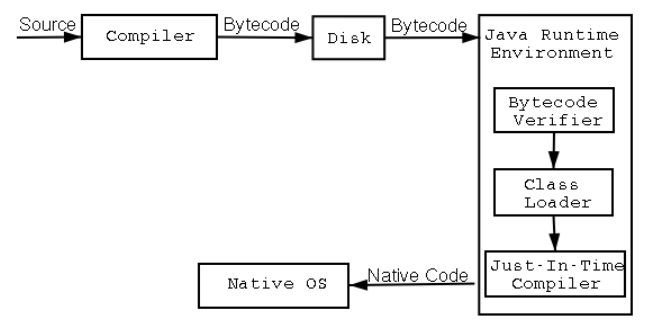

  - **编译过程** ： 当执行“javac HelloWorld.java”命令的时候，会.java源文件编译成.class二进制字节码文件。

  - **运行过程**

    1.类加载

  ​                编译好的字节码文件首先经过字节码校验器对文件进行校验,最终要通加载器加载   

  ​         到JVM虚拟机中。这里需要说明一下，程序第1次主动使用类的时候，才会去加载该	

  ​         类。也就是说不是一开始就把所有的类都加载到内存中，用的的时候才会加
  ​         载，并且只加载一次。

  ​       2.类的执行

  ​                当执行“java com.itheima.HelloWorld” 命令的时候，系统就会启动一个JVM进

  ​        程，JVM进程从classpath路径中找到一个HelloWorld.class二进制文件，首先将   

  ​        HelloWorld类信息加载到方法区内，这个过程叫做类加载过程。JVM完成堆栈内存存储

  ​        数据之后，JVM解释完之后，会将该文件发送给JIT编译器(将class文件编译成机器代s

  ​        码)。

- **问题回答:**  3个关键词

  - **编译**：Java编译器会对源文件进行编译成class字节码文件，这一过程就叫做“编译过程”。

  - **加载**：类加载器会将class字节码文件加载到JVM完成解释

  - **运行**：JVM将class字节码文件解释完之后会发给JIT编译器，以翻译成机器代码，进行运  

    ​           行。

### 1.2 类加载生命周期

- 类加载生命周期

  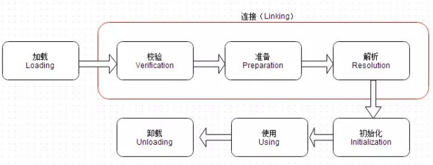

  > ​       通过上图可以看到，Class类加载的整个生命周期中，包括5个阶段，但是其中三个阶段是主要的，分别如下：

  - <u>**加载**</u>：通过类的全限定名来获取定义此类的二进制字节流，将内部静态结构转为方法区的运行是数据结构，并在堆中生成一个java.lang.Class对象。Java虚拟机不会无条件装载Class类型，必须要求类或者接口必须是==主动引用==，才能被装载。

    ```java
    1.当创建一个类的实例时，比如使用new关键字，或者通过反射、克隆、反序列化。
    2.当调用类的静态方法时，即当使用了字节码invokestatic指令。
    3.当使用类或者接口的静态字段时（final常量除外），比如，使用getstatic指令。
    4.当使用java.lang.reflect包中的方法反射类的方法时。
    5.当初始化子类时，要求先初始化父类。
    6.作为启动虚拟机，含有main()方法的那个类。
      除了以上的情况属于主动使用，其他的情况均属于被动使用。被动使用不会引起类的初始化。
    ```

  - <u>**连接**</u>：将已读入内存的二进制数据合并到JVM运行时环境中

  - <u>**初始化**</u>：JVM会按照初始化语句在类文件中的先后顺序执行

- **案例1-2-1**：主动引用

  > **步骤一**：创建Father类和Son类

  ```
  /**
   * 父类
   */
  public class Father {
      static {
          System.out.println("完成父类静态代码块初始化");
      }
      public static String myname="itheima";
  }
  /**
   * 创建子类继承父类
   */
  public class Son extends  Father{
      static {
          System.out.println("完成子类静态代码块初始化");
      }
  }
  ```

  > **步骤二**：创建测试类，测试调用父类静态变量

  ```java
  
  /**
   * 测试：子类调用父类静态成员，是否对子类进行加载和初始化？
   */
  public class LoaderFatherTest {
      public static void main(String[] args) {
          Son son = new Son();
      }
  }
  ```

  > **步骤三**：在VM option中添加java命令执行可以实现追踪类加载过程信息的参数

  ```java
   -XX:+TraceClassLoading
  ```

    控制台打印：

  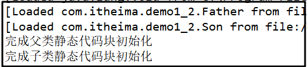

  > **总结**：

  ```java
  1.通过new关键词创建类的实例会加载相关类，首先加载Father类，再加载Son类
  2.在初始化子类的时候，首先先初始化父类。
  ```

  

- **案例1-2-2**：被动引用不会导致类的装载案例

  > **步骤一**：创建测试类，测试调用父类静态变量

  ```java
  在案例1-2-1基础上修改测试类
  /**
   * 测试：子类调用父类静态成员，是否对子类进行加载和初始化？
   */
  public class LoaderFatherTest {
      public static void main(String[] args) {
          System.out.println(Son.myname);
      }
  }
  ```

  控制台打印：

  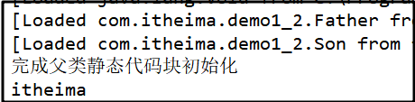

  > **总结**：

  ```java
  1.Father类和Son类都有被类加载器加载JVM中了。
  2.打印出了“完成父类静态代码块初始化”语句说明父类Father类进行初始化。但是
      子类Son虽然被加载了但是没有被初始化。
  3.打印出了“itheima”数值，则说明了只有直接定义该字段的类才会被初始化。  
  ```

### 1.3 双亲委派机制

- **类加载器介绍**

  - 类加载器作用

    ​      类加载器可以将classpath目录下.class文件,加载到内存中来进行一些处理,处理完的结果就是一些字节码。

  - 类加载器本质

  ```java
    Java虚拟机中可以安装多个类加载器，系统默认的3个加载器，每个类加载器负责加载不同位置的 类:BootStrap,ExtClassLoader,AppClassLoader。类加载器也是java类，但是这里说一下BootStrap不是
  一个java类，不需要类加载器加载，它是嵌套在JVM中内核里面的。它可以加载ExtClassLoader和 
AppClassLoader加载器。
  ```

  

- **双亲委派机制介绍**

  ​        从JDK1.2开始类加载采用父亲委托机制。如果一个类加载器收到了类加载器的请求.它首先不会自己去尝试加载这个类.而是把这个请求委派给父加载器去完成.每个层次的类加载器都是如此.因此所有的加载请求最终都会传送到Bootstrap类加载器(启动类加载器)中.只有父类加载反馈自己无法加载这个请求(它的搜索范围中没有找到所需的类)时.子加载器才会尝试自己去加载。

  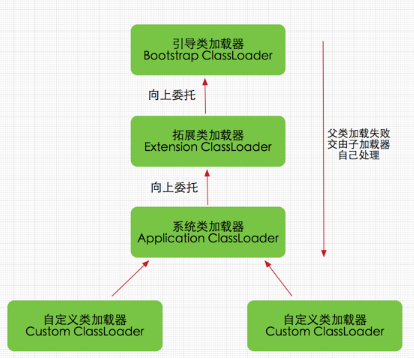

  ```java
  1.启动类加载器
     Bootstrap ClassLoader，负责加载存放在JDKjrelib(JDK代表JDK的安装目录，下同)下，或被-Xbootclasspath参数指定的路径中的，并且能被虚拟机识别的类库（如rt.jar，所有的java.*开头的类均被Bootstrap ClassLoader加载）。启动类加载器是无法被Java程序直接引用的。
  2.扩展类加载器
     Extension ClassLoader，该加载器由sun.misc.Launcher$ExtClassLoader实现，它负责加载DKjrelibext目录中，或者由java.ext.dirs系统变量指定的路径中的所有类库（如javax.*开头的类），开发者可以直接使用扩展类加载器。
  3.应用程序类加载器
     Application ClassLoader，该类加载器由sun.misc.Launcher$AppClassLoader来实现，它负责加载用户类路径（ClassPath）所指定的类，开发者可以直接使用该类加载器，如果应用程序中没有自定义过自己的类加载器，一般情况下这个就是程序中默认的类加载器。
  ```

  

- 类加载器委派过程

  **案例1-3**:   打印所当前类的所有上层的加载器的名称

  ```java
  /**
   * 打印出测试类所有加载器
   */
  public class ClassLoaderTest {
      public static void main(String[] args) {
          ClassLoader classLoader = ClassLoaderTest.class.getClassLoader();
          while(classLoader!=null){
              String name = classLoader.getClass().getName();
              System.out.print("----> " + name);
              classLoader = classLoader.getParent();
          }
          System.out.println("---->"classLoader);
      }
  }
  ```

  控制台打印：	

  ```
  sun.misc.Launcher$AppClassLoader---->sun.misc.Launcher$ExtClassLoader---->null
  ```

  > **总结**

  ```java
    从上面的结果可以看出，并没有获取到ExtClassLoader的父Loader，原因是Bootstrap Loader（引导类加载器）是用C语言实现的，找不到一个确定的返回父Loader的方式，于是就返回null。
  ```

  

  > ==面试热频问题1==：java类从编译到运行完整过程是怎样的？  编译+加载+运行
  > ==面试热频问题2==：什么是类加载器？ 类加载器是什么+三种类型的加载器
  > ==面试热频问题3==：类装载流程是怎样的？ 加载+连接+初始化（加载进去之后，要满足主动引用条件）
  > ==面试热频问题4==：请你说一下类加载中双亲委派机制是什么？下层到上层委派，上层到下层 2个过程

------

##  2. JVM的内存模型

### 2.1 JVM三种类型参数

```java
jvm的参数类型分为三类，分别是：
(1)标准参数
    -help     查看帮助文档
    -version  查看版本
    -classpath 指定class路径
    -server： 服务端模式
	-client： 客户端模式
	-showversion  输出产品版本并继续
(2)-X参数 （非标准参数）
    -Xint ：设置为解释模式执行
    -Xcomp：设置为编译模式执行，编译模式下，第1次执行会比解释模型要慢一些
    -Xmixed：默认为混合模式
(3)-XX参数（相对不稳定，用户可以自己设置，jvm调优和debug都是用这类参数，使用率较高）
   1.-XX:[+-]<NAME>表示启用或者禁用name属性  
       例如：-XX:+UseG1GC ，表示启动UseG1进行垃圾回收
   2.-XX:<NAME>=<VALUE>表示name属性的值是value  
       例如：-XX:MaxGCPauseMillis=500
       例如：-XX:NewRatio=1 ，表示新生代和老年代的比值
   3.特例
       例如：-Xms等价于-XX:InitialHeapSize -Xms512m  设置JVM初始堆内存为512M
       例如：-Xmx等价于-XX:MaxHeapSize  -Xmx2048m 设置JVM最大堆内存为2048M
```

**案例2-1-1**：标准参数-D设置系统属性

> **步骤一**：创建JVMOptionsTest类

```java
public class JVMOptionsTest {
    public static void main(String[] args) {
        String myname = System.getProperty("myname");
        System.out.println("从jvm系统中获取的myname变量值为 = " + myname);
    }
}   
```

> **步骤二**：添加标准化参数 -Dmyname=itheima

```java
方法一：使用命令运行
  java  -Dmyname=itheima com.itheima.demo2_1.JVMOptionsTest
方法二：在开发工具中的JVM options中设置
  -Dmyname=itheima    
注意：这里的-D后面参数名称有大小写区分。
```

**案例2-1-2**：非标准参数-X设置不同模式执行

```java
java  -showversion -Xint  com.itheima.demo2_1.JVMOptionsTest     //设置解释模式
java  -showversion -Xcomp com.itheima.demo2_1.JVMOptionsTest    //设置编译模式
java  -showversion com.itheima.demo2_1.JVMOptionsTest   //默认的混合模式
```

**案例2-1-3**：非标准参数-XX参数

```java
1.-XX:+DisableExplicitGC 表示禁用手动调用gc操作，也就是说调用System.gc()无效
   java -showversion -XX:+DisableExplicitGC com.itheima.demo2_1.JVMOptionsTest 
   
2.-Xms512m -Xmx2048m 分别设置初始化堆内存大小、最大堆内存大小
   java -Xms512m -Xmx2048m com.itheima.demo2_1.JVMOptionsTest
```

###  2.2 JVM内存逻辑模型

- JVM运行内存逻辑模型

  

  - 虚拟机栈：

    ```
      Java虚拟机栈也是线程私有的内存空间，它和Java线程在同一个时间创建，它保存方法局部变量、部分结果，并参与方法的调用和返回。
    ```

  - 堆：

    ```
       Java堆可以说是Java运行时内存中最为重要的部分，几乎所有的对象和数组都是堆中分配空间的。Java堆分为新生代和老年代两个部分，新生代用于存放刚刚产生的对象和年轻的对象，如果对象一直没有被回收，生存得足够长，老年对象就会被移入老年代。
    ```

  - 方法区：
  
    ```java
       方法区也叫永久区，它是JVM内存区中非常重要的一块内存区域，与堆空间类似，它也是被JVM中所有线程共享的。方法区主要保存的信息是类的元数据。这些元数据包括：类的类型信息(类名、父类名、修饰符等)、常量池、域信息、方法信息(方法名、返回类型、方法参数、修改符等)。总之，方法区中保存的信息，大部分来自于class文件，也是Java应用程序运行必不可少的重要数据。   
    ```

  - 程序计数器： 
  
    ```
     程序计数器是一块很小内存空间。由于Java是支持线程的语言，当线程数量超过CPU数量时，线程之间根据时间片轮训抢夺CPU资源。对于单核CPU而言，每一个时刻，只能有一个线程在运行，而其他线程必须被切换出去。为此，每一个线程都必须用一个独立的程序计数器，用于记录下一条要运行的指令。各个线程之间的计数器互不影响，独立工作；是一块线程私有内存空间。如果当前线程正在执行一个Java方法，则程序计数器记录正在执行的Java字节码地址，如果当前线程正在执行一个Native方法，则程序计数器为空。
    ```
  
  - 本地方法栈:
  
    ```java
       本地方法栈和Java虚拟机栈的功能很相似，Java虚拟机栈用于管理Java函数调用，而本地方法栈用于管理本地方法的调用。本地方法并不是用Java实现的，而是使用C实现的。在SUN 的HotSpot虚拟机中，不区分本地方法栈和虚拟机栈。因为，和虚拟机栈一样，它也会抛出StackOverflowError和OutOfMemoryError。
    ```
  
    **总结：**    
    
    ```java
      JVM运行内存逻辑模型包括堆、虚拟机栈、方法区、程序计算器、本地方法栈。其中堆、虚拟机栈、方法区是我们要重点理解的，学习JVM是帮助我们做JVM调优，而堆、栈、方法区是最常见的优化关注3块。
    ```

### 2.3 虚拟机栈

> ​       Java虚拟机规范允许Java栈的大小是动态的或者是固定的。在Java虚拟机规范中，定义了两种异常与栈空间有关：StackOverflowError和OutOfMemoryError;如果线程在计算过程汇总，请求的栈深度大于最大可用的	栈深度，则抛出StackOverflowError;如果Java栈可以动态扩展，而在扩展栈的过程中，没有足够的内存空间来支持栈的扩展，则抛出OutOfMemoryError.在HotSpot虚拟机中，可以使用-Xss参数来设置栈的大小。栈的大小直接决定了函数调用的可达深度。如下案例展示了一个递归调用的应用。计数器count记录了递归的层次，这个没有出口的递归函数一定会导致栈溢出。程序则在栈溢出时，打印出栈的当前深度。

- **实战2-3**：StackOverflowError 错误分析演示

> **步骤一**：递归调用打印出一个方法最大调用次数可以反馈出栈的当前深度

```java
/**
 * 对JVM 内存模型进行测试
 */
public class TestJVMStack 
    //1.声明一个统计函数调用次数的计数变量
    private int count=0;
    /**
     * 2.声明一个递归函数，该函数调用会产生死循环
     */
    public void recursion(){
        count++;
        recursion();
    }
    /**
     * 3.测试调用该递归函数，打印出统计调用次数
     */
    @Test
    public void testStack(){
        try {
            recursion();
        } catch (Error e) {
            System.out.println("deep of stack is  " +count);
            e.printStackTrace();
        }
    }
}
```

   控制台打印：
```java
deep of stack is 20630  
java.lang.StackOverflowError
分析：count变量值输出为20630值不是固定的。但是这反映出了函数调用的深度并不大。
```

> **步骤二**：通过设置-Xss参数来调大栈的内存大小再看栈的深度，对比体会设置栈大小作用

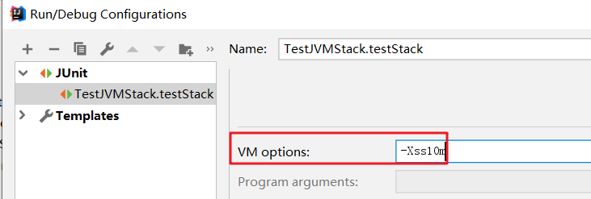

​		

 控制台打印出                      

```java
deep of stack is 216017
java.lang.StackOverflowError
```

> **总结：**	

```java
1.-Xss参数设置增加了栈空间大小，程序支持的函数调用深度明显有上升。
```

### 2.4 堆

#### 2.4.1 堆内存分区简介

> JVM的内存模型在1.7和1.8有较大的区别，我们将先学习1.7再学习1.8的内存模型。
>

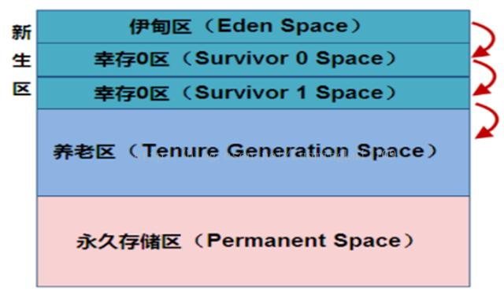

​                                                                             上图 JDK1.7 堆内存图

​                             

​                                               上图JDK1.8 废除了JDK1.7中永久区，换成了MetaSpace

- Young 年轻区（代）

  ```java
    新生代又可进一步细分为eden、survivor space0(简称s0或者from space) 、survivor space1(简称s1或者 to space)。eden意义为伊甸园，即对象的出生地，大部分对象刚刚建立时，通常会存放在这里。s0和s1为survivor空间，翻译成中文为幸存者，也就是说存放其中的对象至少经历了一次垃圾回收，并得以幸存。 
  ```

- Tenured 年老区(代)

  ```java
     如果幸存区的对象到了指定年龄仍未被回收，则有机会进入老年代。一般如果系统中用了application级别的缓存，缓存中的对象往往会被转移到这一区间。
  ```

- Perm 永久区(代)

  ```
   Perm代主要保存class,method,filed对象，这部份的空间一般不会溢出，除非一次性加载了很多的类，不过在涉及到热部署的应用服务器的时候，有时候会遇到java.lang.OutOfMemoryError : PermGen space 的错误，造成这个错误的很大原因就有可能是每次都重新部署，但是重新部署后，类的class没有被卸载掉，这样就造成了大量的class对象保存在了perm中，这种情况下，一般重新启动应用服务器可以解决问题。
  ```
  
  
  
  > **总结:**
  
  ```java
  1.堆空间可以简单分为新生代和老年代。新生代用于存放刚产生的新对象，老年代则存放年长的对象（存在时间较长，经过垃圾回收次数较多的对象）。
  
  2.现实使用中，由于永久代内存经常不够用或发生内存泄露，爆出异java.lang.OutOfMemoryError: PermGen。基于此，JDK1.8将永久区废弃，而改用元空间，改为了使用本地内存空间。Metaspace所占用的内存空间不是在虚拟机内部，而是在本地内存空间中，这也是与1.7的永久代最大的区别所在。
  ```
  
  ​    

#### 2.4.2 堆内存分配实战

**案例2-4**：感受JVM堆内部结构

> **步骤一**：创建实例对象

```java
public class TestHeapGC {
    public static void main(String[] args) {
        byte[] b1=new byte[1024*1024/2];
        byte[] b2=new byte[1024*1024*8];
        b2=null;
        b2=new byte[1024*1024*8]; //进行第1次垃圾回收
        System.gc();
    }
}
```

> **步骤二**：使用JVM参数参数

```java
-XX:+PrintGCDetails -XX:SurvivorRatio=8 -XX:MaxTenuringThreshold=15 -Xms40M -Xmx40M -Xmn20M
```

> **步骤三**：分析控制GC详细数据

```java
[GC (System.gc())      [PSYoungGen: 11326K->1272K(18432K)] 19518K->9472K(38912K), 0.0020069 secs] [Times: user=0.00 sys=0.00, real=0.00 secs] 
[Full GC (System.gc())  [PSYoungGen: 1272K->0K(18432K)] [ParOldGen: 8200K->9375K(20480K)] 9472K->9375K(38912K), [Metaspace: 3490K->3490K(1056768K)], 0.0044752 secs] [Times: user=0.00 sys=0.00, real=0.00 secs] 
```

> **总结**：

```java
通过设置参数可以看到堆内存GC过程；控制台打印出一共有2次GC。
第1次GC:堆大小是38912K，年轻代是18432 通过GC 由11326K减少为1272K。
第2次GC:堆大小是38912K，年轻代是18432K 通过GC由1272K减少为0K；老年代是20480K，由8200K增加到9375K。	     Metaspacke是1056768K，内存没有发生变化。
```


#### 2.4.3 堆和栈数据存储过程

- 案例：创建student1和student2是如何分配内存的？

```java
  public class HeapStackMemory {
      public static void main(String[] args) {
          Student student1 = new Student();
          student1.setName("林青霞");
          Student student2 = new Student();
          student2.setName("张曼玉");
      }
  }
```

- 问题分析

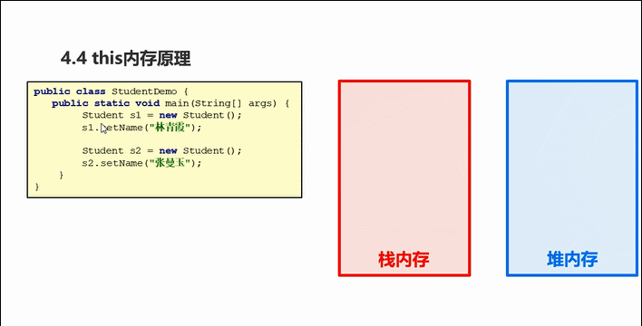

```java
1.main方法入栈， s1引用类型声明，指向了堆中对象s1。
2.setName方法入栈，会执行setName方法，根据地址找到堆中变量赋值。setName方法调用完然后出栈。
3.main方法中s2引用类型声明，指向了堆中对象s2。
4.setName方法入栈，会执行setName方法，根据地址找到堆对中变量赋值。setName方法调用完然后出栈。 
```

> **总结:**

```java
1.方法的调用和执行，都是在栈中完成的，这一过程也称之为“方法入栈和出栈”。方法中局部变量都会随着方法进去
  栈中。引用类型的变量值指明堆中对象的地址。
2.this代表的调用该方法调用对象，谁调用该方法，this就是谁。
```


#### 2.4.4 堆和栈区别

- **问题回答**：分别根据存储数据类型、堆栈数据结构、缓存方式、空间分配4个维度来区别。

  - <u>存储数据类型</u>   掌握

    ​           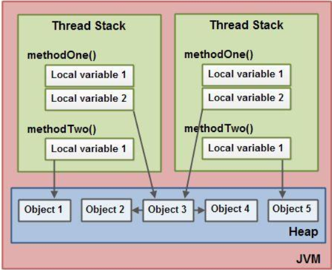

    - **栈中存储局部变量**：这里所说的栈，也称之为“虚拟机栈”，它里面主要存放一些基本类型的局部变量(int, short, long, byte, float, double, boolean, char)和对象引用。
    - **堆中存储对象属性**：heap是JVM的内存数据区。每次分配不定长的内存空间，专门用来保存对象的实例。实际上也只是保存对象实例的属性值，属性的类型和对象本身的类型标记等，并不保存对象的方法（方法是指令，保存在Stack中）。对象实例在Heap中分配好以后，需要在Stack中保存一个4字节的Heap内存地址，用来定位该对象实例在Heap中的位置，便于找到该对象实例。

  - <u>堆栈数据结构</u>   掌握

    - 栈数据结构：先进后出特点数据结构。如 桶

      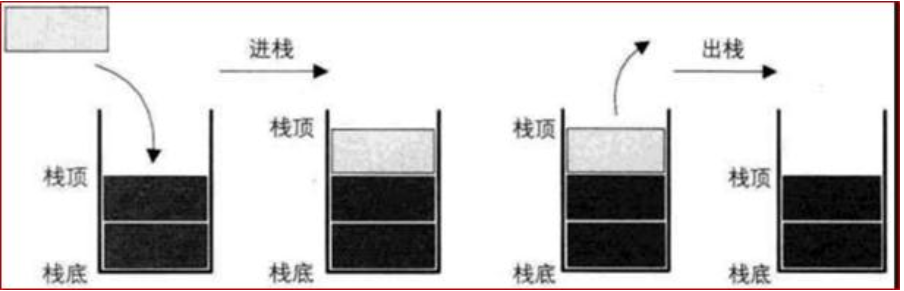

    - 堆数据结构：先进先出特点数据结构，如 树

      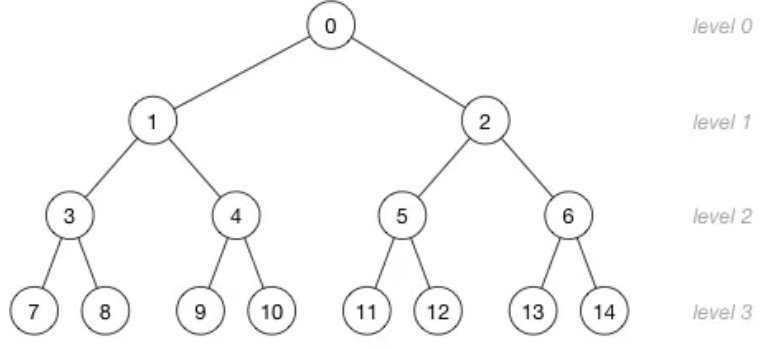

  - 堆栈缓存方式  了解

    - 栈使用的是一级缓存， 他们通常都是被调用时处于存储空间中，调用完毕立即释放；
    - 堆是存放在二级缓存中，生命周期由虚拟机的垃圾回收算法来决定（并不是一旦成为孤儿对象就能被回收）。所以调用这些对象的速度要相对来得低一些。

  - 堆栈空间分配   了解

    - 栈（操作系统）：由操作系统自动分配释放 ，存放函数的参数值，局部变量的值等。其操作方式类似于数据结构中的栈；
    - 堆（操作系统）： 一般由程序员分配释放， 若程序员不释放，程序结束时可能由OS回收，分配方式倒是类似于链表。

### 2.5 方法区

**实战2-5**：让永久区饱和，观察垃圾回收

> **步骤一：**创建String常量放入常量池

```java
public class TestGenGC {
    public static void main(String[] args) {
        for (int i = 0; i < Integer.MAX_VALUE; i++) {
            String s = String.valueOf(i).intern();// 加入到常量池中
        }
    }
}
```

> **步骤二**：设置方法永久区大小

```java
设置参数： -XX:+PrintGCDetails
```

 控制台打印：

```
[GC (Allocation Failure) [PSYoungGen: 139776K->1048K(174592K)] 139776K->1056K(1013760K), 0.0579842 secs] [Times: user=0.05 sys=0.00, real=0.06 secs] 
[GC (Allocation Failure) [PSYoungGen: 140824K->1112K(174592K)] 140832K->1120K(1013760K), 0.1899623 secs] [Times: user=0.20 sys=0.00, real=0.19 secs] 
```

> **总结：**

```java
1.每当常量池饱和时，GC总能顺利回收常量池中的数据，确保程序稳定持续运行。
```

**==面试热频问题5==**：<u>堆栈内存空间是如何存储数据的？this代表的是什么？</u>      1.堆栈区别+2.堆栈配合使用

**==面试热频问题6==**：<u>堆和栈区别有哪些?</u>  存储数据类型+数据结构

